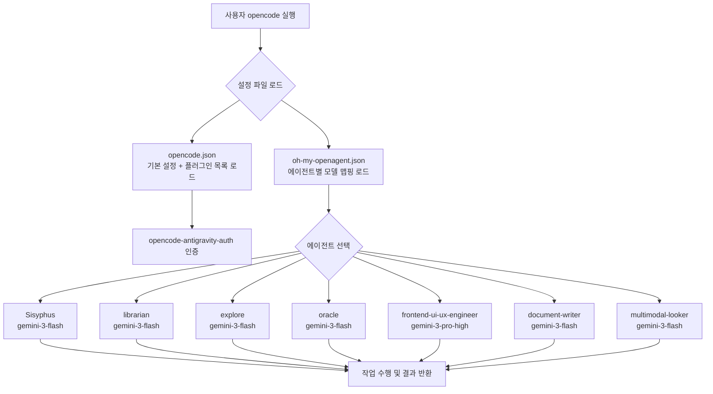
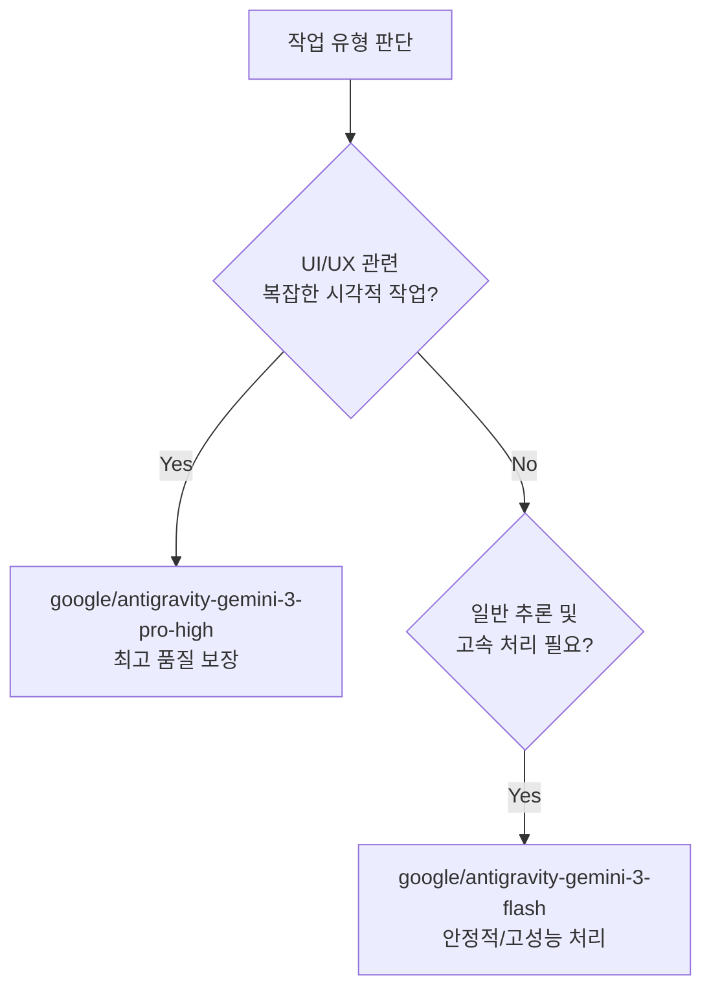

# opencode-ohmyopencode 설정 개발일지

> **프로젝트**: opencode + oh-my-opencode 멀티 에이전트 설정 관리
> **작성일**: 2026-05-14
> **작업자**: git2583

---

## 📌 목차

1. [프로젝트 개요](#1-프로젝트-개요)
2. [폴더 구조 아카이브](#2-폴더-구조-아카이브)
3. [프로젝트 작업 흐름도](#3-프로젝트-작업-흐름도)
4. [주요 구현 내용 및 기술 스택](#4-주요-구현-내용-및-기술-스택)
5. [설정 파일 아키텍처](#5-설정-파일-아키텍처)
6. [세션별 상세 작업 로그 및 트러블슈팅](#6-세션별-상세-작업-로그-및-트러블슈팅)
7. [향후 계획 및 미해결 부채](#7-향후-계획-및-미해결-부채)

---

## 1. 프로젝트 개요

본 프로젝트는 AI 코딩 도구인 **opencode**와 **oh-my-opencode** 플러그인을 결합하여, 다양한 역할을 수행하는 **멀티 에이전트(Multi-Agent) 설정 시스템**을 구축하고 관리하는 것을 목표로 합니다.

### 핵심 목표

- `opencode.json` : 기본 플러그인 설정 관리 (antigravity 인증 및 oh-my-openagent 활성화)
- `oh-my-openagent.json` : 에이전트 역할별 최적화된 모델 할당 및 가용 모델 기반 라우팅
- 각 에이전트에 최적화된 AI 모델(Gemini 3 시리즈)을 배치하여 작업 효율 극대화

### 기술 스택

| 구분 | 기술/도구 | 버전/상세 |
|------|-----------|-----------|
| AI 코딩 도구 | opencode | 최신 |
| 플러그인 | oh-my-opencode | latest |
| 인증 플러그인 | opencode-antigravity-auth | latest |
| 런타임 환경 | Bun Baseline | AVX2 미지원 CPU 호환 빌드 |
| 패키지 매니저 | npm | @opencode-ai/plugin 1.14.48 |
| 설정 형식 | JSON (JSON Schema 검증) | - |
| 버전 관리 | Git + GitHub | - |

### 사용 모델 목록 (최종 업데이트)

| 에이전트 | 모델 | 역할 |
|---------|------|------|
| **Sisyphus** | google/antigravity-gemini-3-flash | 범용 작업 및 반복 처리 |
| **librarian** | google/antigravity-gemini-3-flash | 문서/지식 관리 및 검색 |
| **oracle** | google/antigravity-gemini-3-flash | 분석/추론 (High Variant) |
| **explore** | google/antigravity-gemini-3-flash | 탐색/검색 (고속) |
| **frontend-ui-ux-engineer** | google/antigravity-gemini-3-pro-high | UI/UX 고품질 구현 및 설계 |
| **document-writer** | google/antigravity-gemini-3-flash | README 및 기술 문서 작성 |
| **multimodal-looker** | google/antigravity-gemini-3-flash | 이미지 및 스크린샷 분석 |

---

## 2. 폴더 구조 아카이브

```
C:\Users\a\.config\opencode\
│
├── opencode.json              # 기본 opencode 설정 (플러그인 활성화)
├── oh-my-openagent.json       # oh-my-openagent 에이전트 상세 설정 ★ 핵심
├── antigravity-accounts.json  # antigravity 계정 인증 정보
├── package.json               # npm 의존성 (@opencode-ai/plugin)
├── package-lock.json          # npm 의존성 잠금 파일
├── .gitignore                 # Git 제외 항목
└── node_modules/              # npm 패키지 설치 디렉터리
```

---

## 3. 프로젝트 작업 흐름도



### 설정 파일 의존성 구조

```mermaid
graph LR
    A[opencode 실행 엔진] --> B[opencode.json]
    B --> D[opencode-antigravity-auth@latest\n인증 플러그인]
    B --> E[oh-my-openagent@latest\n에이전트 플러그인]
    E --> G[oh-my-openagent.json\n에이전트 상세 모델 설정]
    G --> F[JSON Schema 검증\noh-my-opencode.schema.json]
```

---

## 4. 주요 구현 내용 및 기술 스택

### 4-1. opencode.json — 플러그인 통합 관리

```json
{
  "$schema": "https://opencode.ai/config.json",
  "plugin": [
    "opencode-antigravity-auth@latest",
    "oh-my-openagent@latest"
  ]
}
```

- **변경 사항**: 기존 단일 플러그인 구조에서 `oh-my-openagent`를 추가하여 멀티 에이전트 기능 활성화

### 4-2. oh-my-openagent.json — 가용 모델 기반 최적화

```json
{
  "agents": {
    "oracle": { "model": "google/antigravity-gemini-3-flash", "variant": "high" },
    "frontend-ui-ux-engineer": { "model": "google/antigravity-gemini-3-pro-high" },
    "sisyphus": { "model": "google/antigravity-gemini-3-flash" }
    ...
  }
}
```

- **설계 전략**: `glm-4.7-free` 미지원에 따른 `gemini-3-flash` 전면 배치
  - **Pro-High**: UI/UX 정밀 작업에 집중 할당
  - **Flash**: 빠른 응답이 필요한 모든 범용 에이전트에 할당하여 효율 극대화

---

## 5. 설정 파일 아키텍처

### 모델 라우팅 의사결정 트리 (업데이트)



---

## 6. 세션별 상세 작업 로그 및 트러블슈팅

---

### 🔧 세션 3: Bun 런타임 호환성 해결 및 환경 구축

**작업 일시**: 2026-05-14 19:46:08 ~ 19:59:43 (KST)
**작업 목표**: AVX2 미지원 CPU에서의 Bun 패닉 크래시 해결 및 자동화 환경 구축

#### [상세 실행 과정 (Execution Logs)]

```text
Phase 1: 오류 진단 및 원인 파악 (약 2.5초)
[+] Diagnosis 2.5s
 => [stderr] panic: Illegal instruction at address 0x7FF715ACF82C
 => [analysis] CPU features (no_avx2) 감지. 표준 Bun 바이너리와의 충돌 확인.

Phase 2: Bun Baseline 바이너리 이식 (약 45초)
[+] Binary Migration 45.0s
 => [download] https://github.com/oven-sh/bun/releases/.../bun-windows-x64-baseline.zip
 => [extract] Expand-Archive to $env:TEMP\bun-baseline
 => [replace] C:\Users\a\.bun\bin\bun.exe 교체 완료

Phase 3: 환경 변수 강제화 및 자동화 (약 10초)
[+] Env Automation 10.0s
 => [set] $env:OH_MY_OPENCODE_FORCE_BASELINE = "1"
 => [profile] Microsoft.PowerShell_profile.ps1에 영구 등록 완료
```

#### 트러블슈팅 — Bun Illegal Instruction (no_avx2)

- **문제**: 구형 CPU에서 Bun 기반 CLI(`oh-my-opencode`) 실행 시 즉시 크래시 발생
- **해결**: 
  1. SSE4.2만 요구하는 **Baseline 빌드**로 바이너리 수동 교체
  2. `OH_MY_OPENCODE_FORCE_BASELINE=1` 환경변수를 통해 플러그인 내부의 AVX2 감지 오동작 방지

---

### 🔧 세션 4: 에이전트 설정 통합 및 모델 최적화

**작업 일시**: 2026-05-14 20:38:12 ~ 20:44:00 (KST)
**작업 목표**: 분산된 설정을 `oh-my-openagent.json`으로 통합하고 가용 모델로 전면 교체

#### [상세 실행 과정 (Execution Logs)]

```text
Phase 1: 설정 이식 및 오타 수정 (약 3.0초)
[+] Config Migration 3.0s
 => [fix] oh-my-openagent.json 1번 라인의 'ㅊ' 제거
 => [merge] opencode1.json의 고성능 모델 설정을 oh-my-openagent.json으로 통합

Phase 2: 가용 모델 기반 리밸런싱 (약 1.5초)
[+] Model Rebalancing 1.5s
 => [replace] 미지원 모델(glm-4.7-free)을 가용 모델(gemini-3-flash)로 전면 교체
 => [cleanup] 불필요해진 opencode1.json 영구 삭제
```

---

## 7. 향후 계획 및 미해결 부채

### ✅ 완료된 항목
- [x] Bun Baseline 환경 구축 및 영구 환경변수 설정
- [x] `oh-my-openagent.json`으로 설정 파일 통합 및 오타 수정
- [x] 가용 Gemini 3 모델 기반 에이전트 최적화

### 🔜 향후 계획
- 🔴 **높음**: 신규 모델(`glm-4.7-free` 등) 출시 시 성능 벤치마크 및 재라우팅
- 🟡 **중간**: 에이전트별 작업 성공률 모니터링 및 자동 모델 스위칭 검토

---

*본 문서는 Antigravity AI 어시스턴트에 의해 KI 표준 가이드라인에 따라 자동 생성되었습니다.*
*마지막 업데이트: 2026-05-14 20:44 KST*
